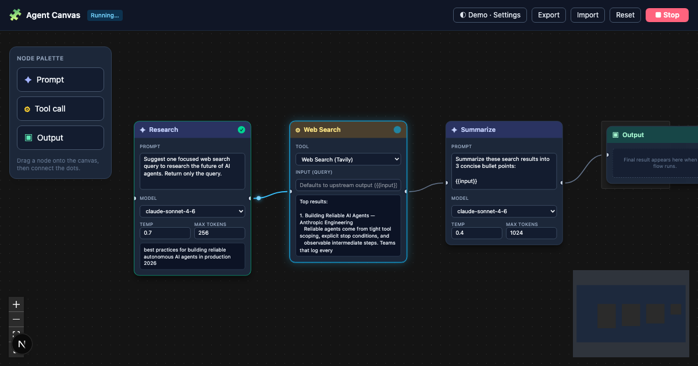

# Agent Canvas

> A visual canvas for composing and debugging AI agents.

Drag out boxes — **prompts, tool calls, outputs** — connect them with arrows, hit **Run**, and watch each box light up and fill with output as the agent executes. The goal: make AI agent runs **visible and debuggable** instead of a wall of scrolling text.

*tldraw meets n8n meets Cline's chat.*



**[▶ Live demo](https://agent-canvas-three.vercel.app)** · [Spec](./SPEC.md) · [Milestones](./PLAN.md)

> The live demo runs in **scripted mode** — real recorded output streams in with no API key needed. Add your own key in **Settings** to run flows against real models and tools.

---

## What it does — the first 60 seconds

Open the app and a finished flow is already on the canvas:

```
[Prompt: research] → [Tool: web search] → [Prompt: summarize] → [Output]
```

Hit the pulsing **Run** button and watch it execute: the active node **glows**, its body fills **token-by-token**, a dot travels along each edge as data flows downstream, and nodes settle green as they complete. No signup, no setup.

Then build your own: drag nodes from the palette, wire them up, and run.

## Highlights

- **Three node types** — *Prompt* (the LLM call, with inline model / temperature / max-tokens and `{{input}}` templating), *Tool call* (Tavily web search or URL fetch), and *Output* (final result + copy button).
- **Runs are visible** — per-node `idle / running / complete / error` states, streamed output, blinking cursor, and animated edges. Debugging an agent becomes *watching* it, not reading logs.
- **Hybrid execution** — a bulletproof **scripted demo** (zero cost, no key) and a **live mode** that calls real models/tools with your own key.
- **Streaming proxy** — a single Next.js API route proxies Anthropic / OpenAI (SSE) and executes tools; your key is sent per-request and never stored server-side.
- **Stop / cancel** a run mid-stream, **export / import** a flow as JSON, and **localStorage** persistence of the canvas.

## How it works

```
React Flow (canvas) ── Zustand ─┬─ graph state  → localStorage
                                └─ run state    → in-memory
                                       │
        executor (topological, async-iterable event stream)
                                       │
                 RunProvider ──┬── scripted (recorded output)
                               └── real ── /api/run (SSE proxy)
                                              ├── Anthropic / OpenAI (stream)
                                              └── Tavily search · URL fetch (Readability)
```

- **Canvas** — [React Flow](https://reactflow.dev) with custom node components per type, designed around the four visual states.
- **State** — a Zustand store splits **graph state** (nodes/edges/positions → persisted) from **execution state** (per-node status/output → in-memory). Narrow per-node selectors mean a streaming token only re-renders its own node.
- **Executor** — runs the DAG in topological order and yields a single **flat event stream**. Node execution returns an *async iterable of events*, not one output, and edges carry a `type` (`data` today, `tool` reserved) — so **agentic loops can be added in V2 without a rewrite** ([SPEC §5](./SPEC.md#5-execution-model-v1--v2-plan--read-this)).
- **Providers** — scripted and real implement the *same* `RunProvider` interface, so the executor and UI are identical in demo and live mode.
- **Proxy** — one Next.js route streams LLM tokens via SSE and runs tools server-side (URL fetch uses Mozilla Readability, truncated to ~4k tokens). Omits `temperature` for `claude-opus-4-7` (which removed sampling params) and sets `cache_control` so re-running a flow can read the prompt from cache.

## Run locally

```bash
npm install
npm run dev        # http://localhost:3000
```

```bash
npm run build      # production build + typecheck
npm run verify     # headless smoke test (start `npm run dev` first)
```

`npm run verify` drives a real headless browser: it renders the demo, runs it end-to-end, hits the proxy's URL-fetch tool for real, exercises the settings / export-import paths, and asserts zero console errors.

### Live runs (bring your own key)

Open **Settings**, switch to **Live**, and paste any of:

| Key | Used by |
| --- | --- |
| Anthropic | Claude prompt nodes |
| OpenAI | GPT prompt nodes |
| Tavily | the Web Search tool (URL Fetch needs no key) |

Keys live only in your browser (localStorage) and are sent per-request to the proxy — never persisted server-side.

## Tech stack

| | |
| --- | --- |
| Framework | Next.js + TypeScript |
| Canvas | React Flow (`@xyflow/react`) |
| State | Zustand |
| Styling | Tailwind CSS |
| LLMs | `@anthropic-ai/sdk`, `openai` (streaming) |
| Tools | Tavily (search), Mozilla Readability + linkedom (URL fetch) |
| Tests | Playwright (headless smoke test) |

## Roadmap (V2)

V1 ships a linear DAG. The data model and executor are built for what comes next:

- **Agentic loops** — a prompt node, given `tool` edges, decides which tools to call, observes results, and loops until done — the classic agent loop, visualized.
- Run history, undo/redo, more node types, collaboration.

## Project docs

- **[SPEC.md](./SPEC.md)** — product + technical spec, data model, and the V1→V2 plan.
- **[PLAN.md](./PLAN.md)** — milestone breakdown (M1–M4).

---

<sub>Built as a portfolio project.</sub>
